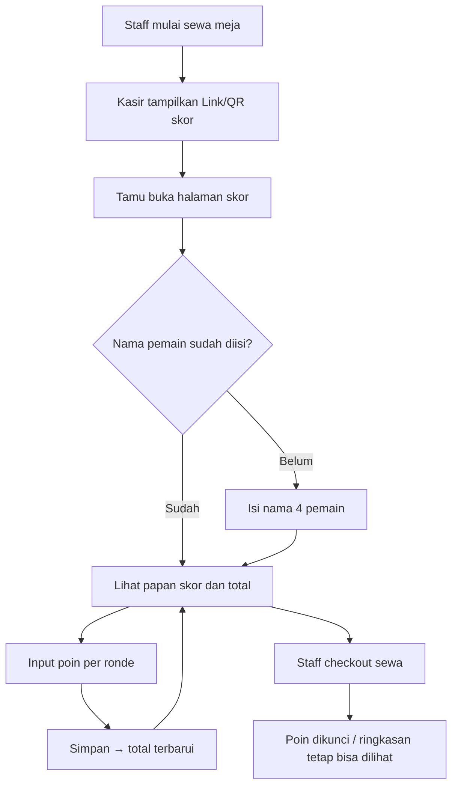

# Catat Poin Mahjong Saat Sewa Meja (Tamu)

Dokumen ini menjelaskan fitur agar **penyewa meja** bisa mencatat poin mahjong sendiri saat bermain santai.

Fitur ini **bukan untuk turnamen**. Turnamen tetap memakai alur terpisah (pendaftaran, klasemen, dll.).

---

## Keputusan produk (v1)

- Staff yang memulai sewa di kasir; tamu membuka skor lewat **link / QR** dari kasir.
- Halaman sewa tamu penuh (`/guest/sewa`) **tidak** diaktifkan ulang.
- **4 pemain** tetap.
- Poin **tidak** wajib berjumlah 0.
- Hanya boleh **batalkan ronde terakhir**.
- Setelah sewa selesai, tamu masih bisa **lihat ringkasan** (tidak bisa mengubah).

---

## Apa yang ingin dicapai?

Saat tamu sedang menyewa meja di Omahjong, mereka bisa:

1. Membuka papan skor di HP (lewat link/QR dari kasir)
2. Mengisi nama pemain di meja tersebut
3. Memasukkan poin setiap ronde / game
4. Melihat total poin sampai sewa selesai

Tujuannya sederhana: **tidak perlu kertas atau kalkulator**, poin tercatat rapi di satu tempat.

---

## Siapa yang memakai fitur ini?

| Siapa | Apa yang bisa dilakukan |
|-------|-------------------------|
| **Staff kasir** | Mulai sewa, tampilkan / salin link skor + QR |
| **Penyewa meja (tamu)** | Membuka skor, mengisi nama pemain, memasukkan poin |
| **Teman di meja yang sama** | Boleh ikut pakai HP yang sama (satu sesi bersama) |

---

## Alur singkat (untuk klien)

```text
1. Staff check-in sewa meja di kasir
2. Staff ketuk meja aktif → “Link skor mahjong” → tampil QR / salin link
3. Tamu scan QR atau buka link di HP
4. Pertama kali: isi nama 4 pemain di meja
5. Setiap selesai satu ronde: isi poin masing-masing pemain → simpan
6. Layar menampilkan total poin terkini
7. Bisa membatalkan ronde terakhir jika salah input
8. Ketika sewa di-checkout staff, pencatatan poin dikunci
9. Ringkasan poin tetap bisa dilihat tamu (read-only)
```



---

## Alur detail (bahasa sehari-hari)

### 1. Mulai dari sewa yang sedang jalan

- Fitur skor **hanya bisa diubah** kalau sewa meja masih aktif.
- Kasir membuka **Link skor mahjong** dari meja yang sedang disewa.
- Tamu membuka link tersebut di HP.

Kalau sewa sudah selesai → skor hanya bisa dilihat, tidak bisa diubah.

### 2. Siapkan nama pemain (sekali saja)

Di awal sesi, penyewa mengisi nama / julukan 4 pemain.

Contoh: Budi, Ani, Citra, Dedi.

Nama ini hanya untuk sesi sewa itu saja, **tidak perlu daftar akun** atau nomor HP tiap pemain.  
Setelah ada ronde yang tercatat, nama dikunci.

### 3. Mencatat setiap ronde

Setelah satu ronde selesai:

- Isi poin untuk tiap pemain
- Boleh tandai siapa yang menang (opsional)
- Tekan simpan

Layar langsung menampilkan **total poin** masing-masing.

### 4. Melihat total berjalan

Di papan skor terlihat:

- Nama pemain
- Total poin
- Riwayat ronde terakhir (agar mudah dicek)

### 5. Salah input?

Bisa **batalkan ronde terakhir** saja.

### 6. Sewa selesai

Ketika staff checkout sewa:

- Pencatatan poin **dikunci**
- Tidak bisa menambah / mengubah poin lagi
- Ringkasan tetap bisa dilihat di link yang sama

Kalau selama sewa tidak pernah membuka “Catat poin”, tidak apa-apa — session skor dibuat saat link diminta/check-in, tapi tanpa ronde.

---

## Hal yang penting bagi pemilik usaha / klien

### Keamanan sederhana (versi awal)

- Yang bisa mencatat poin adalah orang yang membuka **link/QR skor** meja tersebut.
- Tidak perlu login rumit untuk tiap pemain.
- Meja A tidak bisa mengubah skor meja B.

### Bukan turnamen

| Fitur sewa meja (ini) | Fitur turnamen |
|------------------------|----------------|
| Main santai saat sewa | Kompetisi resmi |
| Nama bebas diisi di meja | Pendaftaran peserta |
| Skor hanya untuk meja & sesi itu | Klasemen & juara |
| Tidak mempengaruhi ranking turnamen | Ada status open / berlangsung / selesai |

### Tidak mengubah cara bayar sewa

Poin mahjong **tidak dipakai untuk menghitung biaya sewa**.  
Biaya sewa tetap seperti sekarang (waktu / promo / aturan toko).

---

## Ringkasan satu kalimat

> Saat sewa meja aktif, kasir membagikan link/QR skor; penyewa mencatat poin mahjong bersama teman di HP, melihat total berjalan, lalu skor dikunci otomatis ketika sewa selesai — terpisah dari sistem turnamen.
